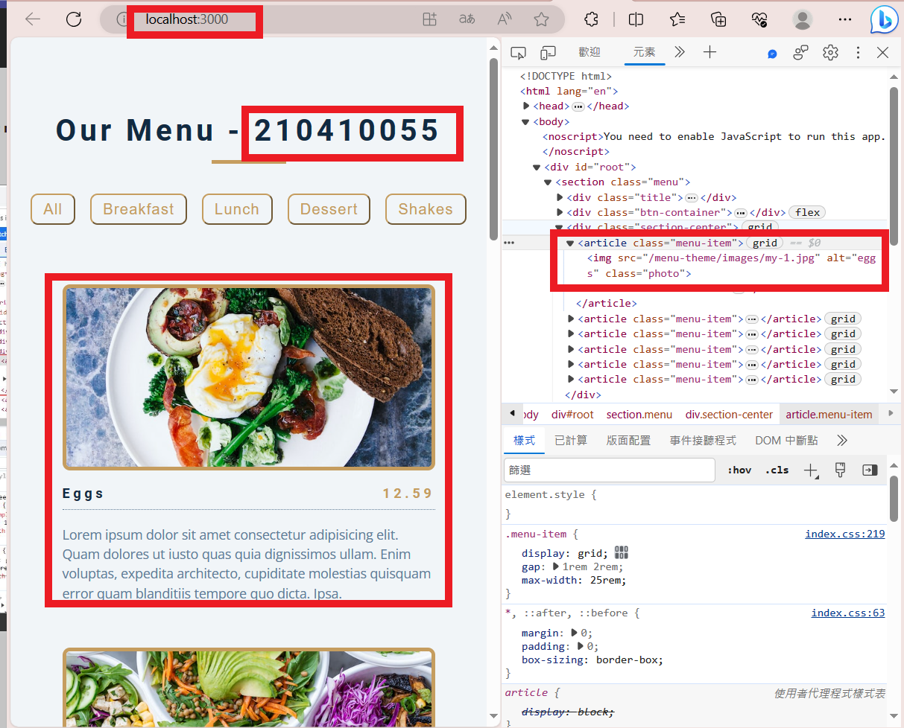
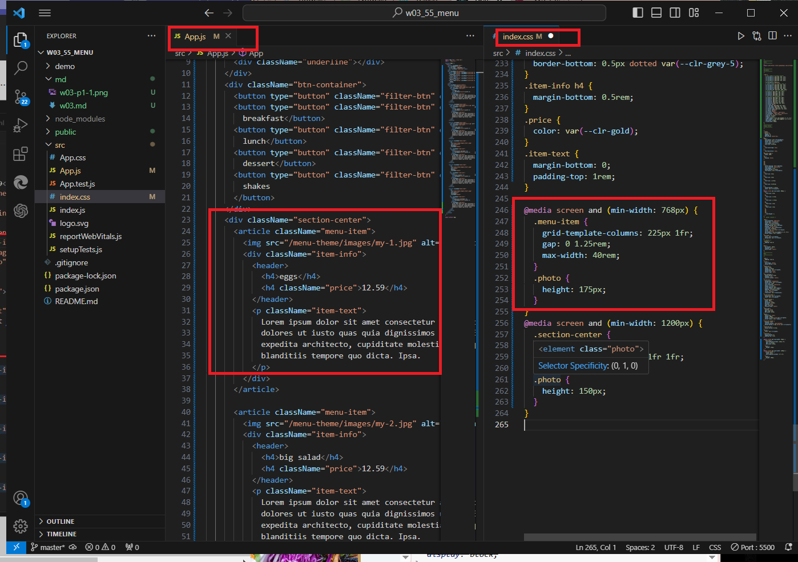
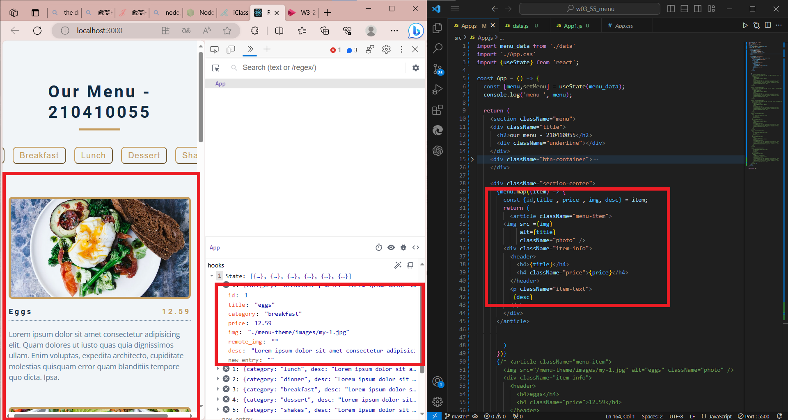
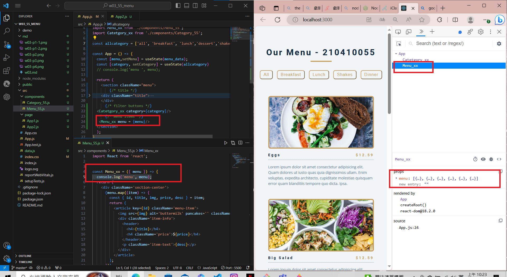
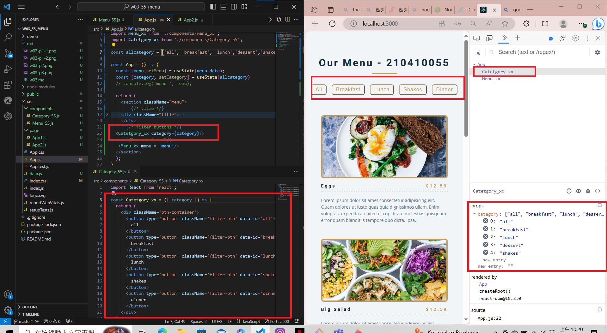
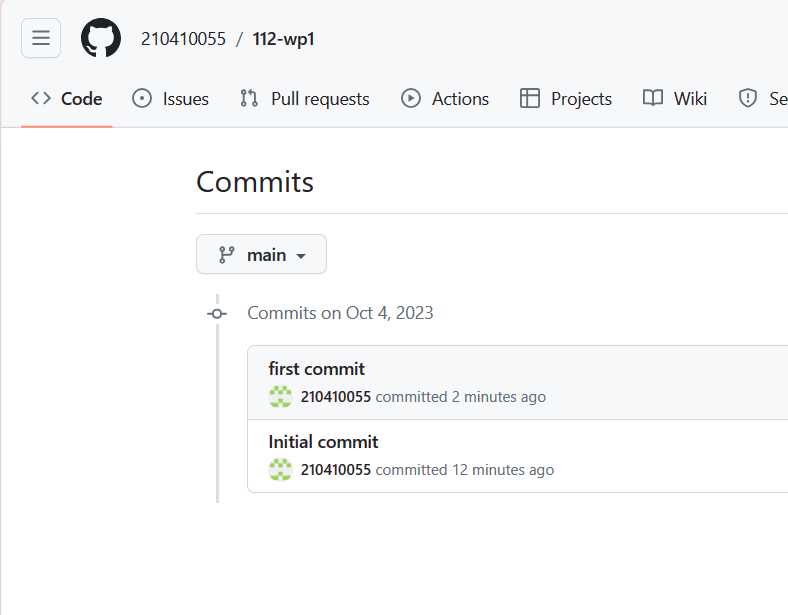

[My Github Repo URL](https://github.com/210410055/112-wp1/tree/main)
### W03-P1: Display all static menus in App.js
 

 


### W03-P2: Display all menu from an array data.js
 


### W03-P3: Display all menu from <Menu_xx />
 


### W03-P4: Display all category buttons from <Category_xx />
 


### W03-P5: show all git logs of W3
 


```
git log --pretty=format:"%h%x09%an%x09%ad%x09%s" --after="2023-09-26"

414f65f 210410055       Wed Oct 4 10:37:36 2023 +0800   first commit
cf02e6c 210410055       Wed Oct 4 10:27:42 2023 +0800   Initial commit

```
 