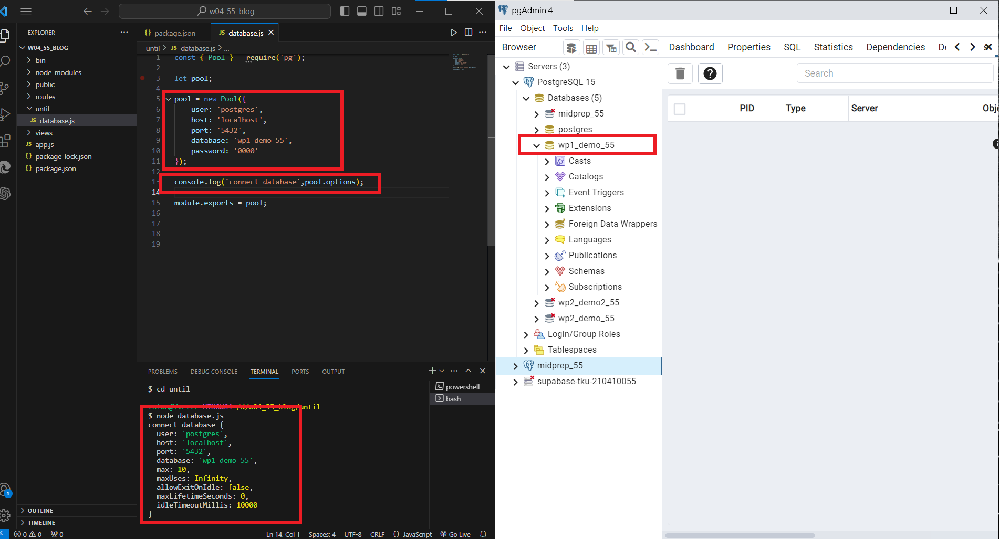
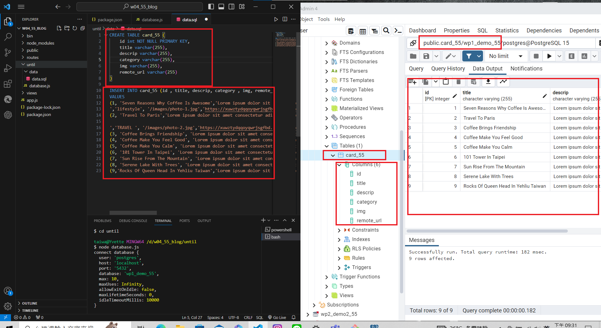
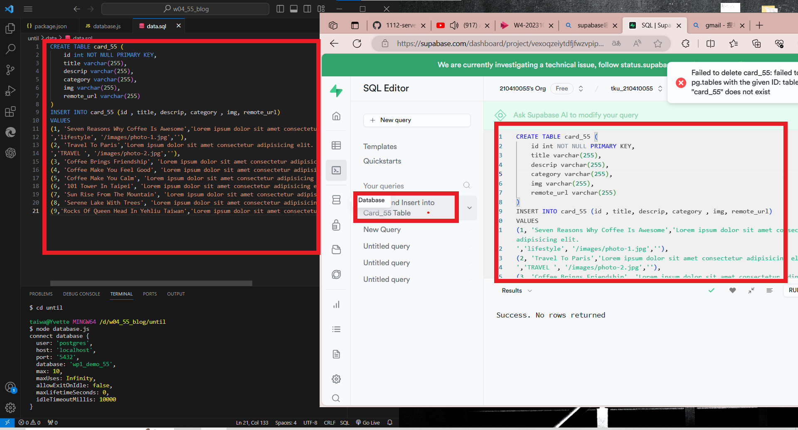
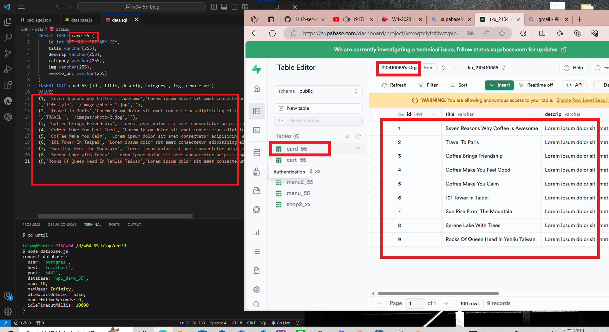
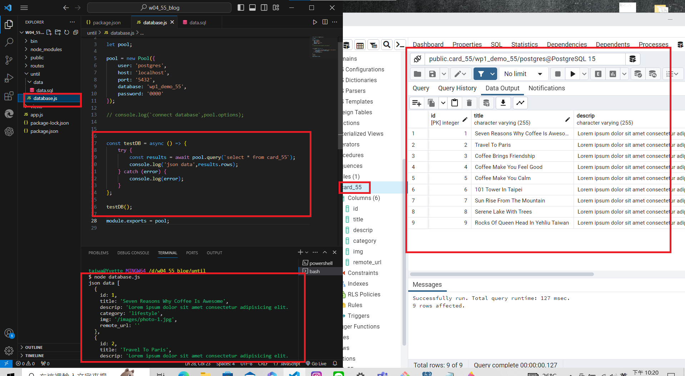
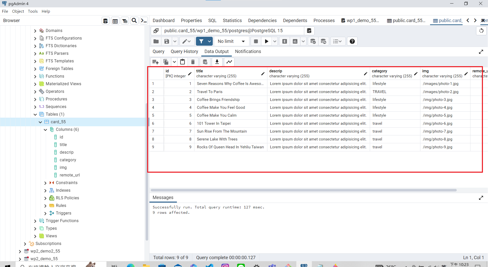
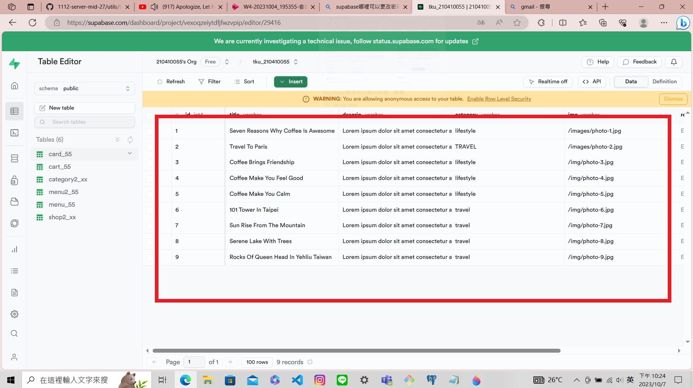
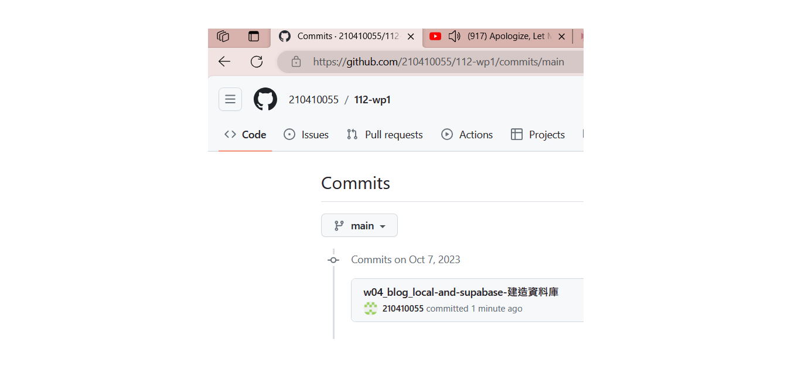

[My Github Repo URL](https://github.com/210410055/112-wp1/tree/main)
### W04-P1: Connect database wp1_demo_xx
 

### W04-P2: Using SQL to create table card_xx, and insert two data
 

### W04-P3: Using Supabase SQL editor to create table card_xx, and insert two data
 

 


 ### W04-P4: Use JavaScript code to get card_xx data from local wp1_demo_xx database
 

 ### W04-P5: Show 9 data in both local PostgreSQL and Supabase
 
#### local PostgreSQL
 

 
#### Supabase
 

### W04-P6: W4 all logs
 


```
$ git log --pretty=format:"%h%x09%an%x09%ad%x09%s" --after="2023-10-03"
d7dff53 210410055       Sat Oct 7 22:31:40 2023 +0800   w04_blog_local-and-supabase-建造資料庫
```