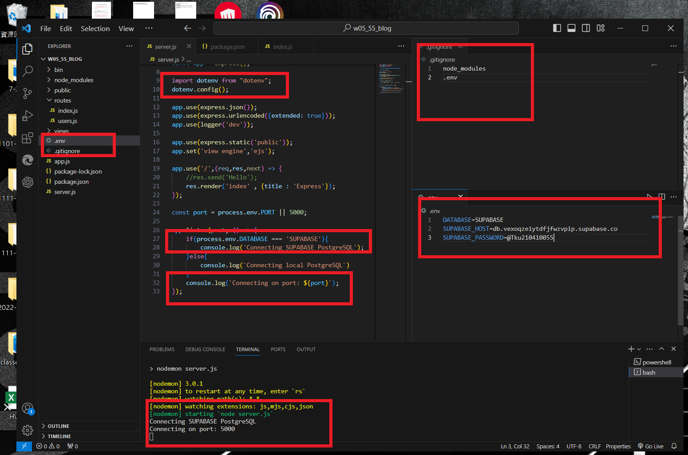
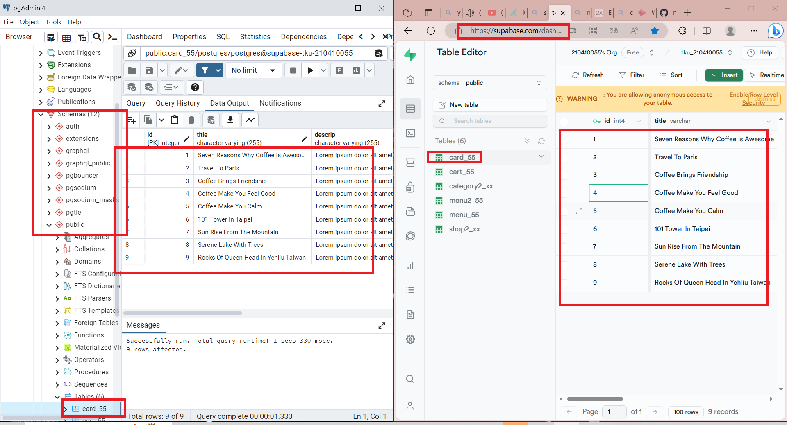
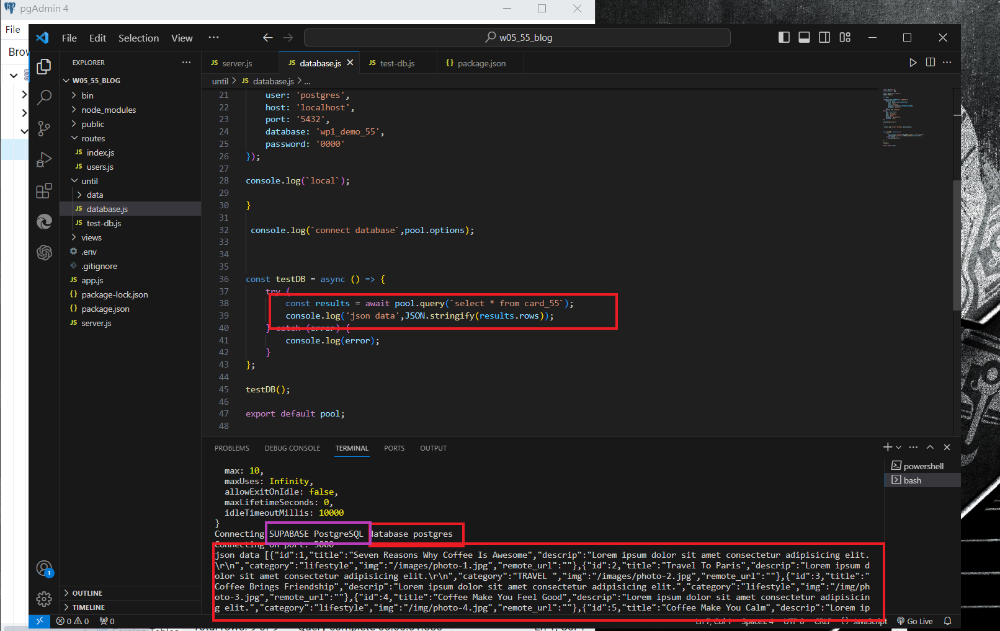
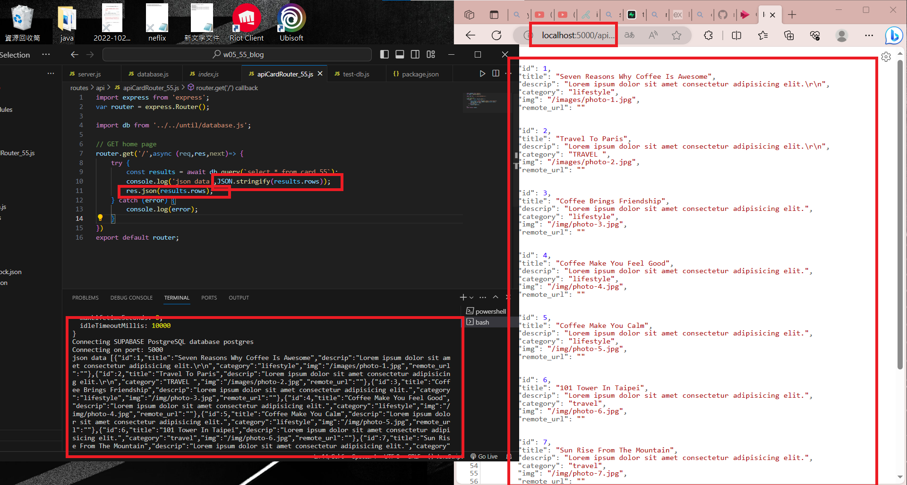

[My Github Repo URL](https://github.com/210410055/112-wp1/tree/main)

### W05-P1: Demo how to use environment variable DATABASE


### W05-P2: Using pgAdmin 4 to get table card_xx from Supabase
 


### W05-P3: Using database.js to connect to Supabase and show card_xx data
 


 ### W05-P4: For route /api/card_xx, get Json data from Supabase
 


```
$ git log --pretty=format:"%h%x09%an%x09%ad%x09%s" --after="2023-10-10"
dd0255f 210410055       Sun Oct 15 12:56:38 2023 +0800   ### W04-P4: For route /api/card_xx, get Json data from Supabase
bb4ac69 210410055       Sun Oct 15 12:19:54 2023 +0800  W05-P3: Using database.js to connect to Supabase and show card_xx data
93a93c2 210410055       Sun Oct 15 11:23:03 2023 +0800   W05-P2: Using pgAdmin 4 to get table card_xx from Supabase
97946bf 210410055       Sun Oct 15 11:15:31 2023 +0800  W05-P1: Demo how to use environment variable DATABASE
```