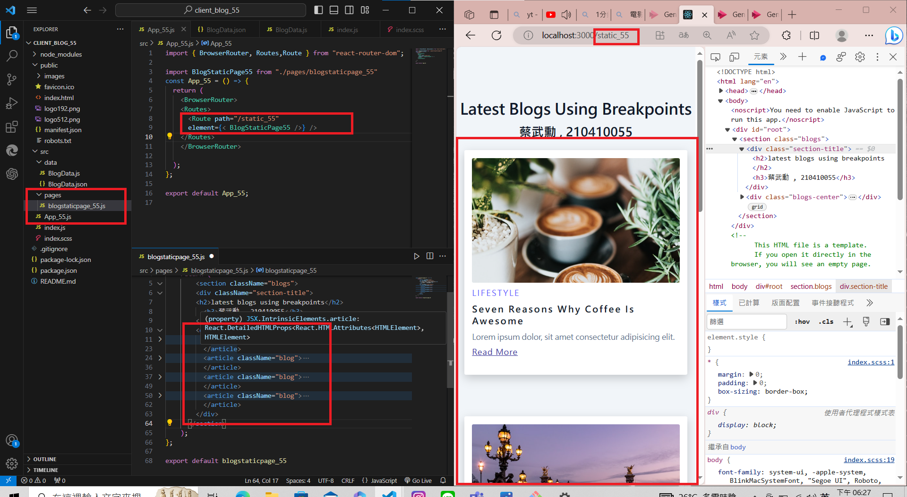

[My Github Repo URL](https://github.com/210410055/112-wp1/tree/main)
 ### W06-P1: Run the server in W5 using /api/card_xx
 

### W06-P2: blog html theme convert to React using scss
 


### W06-P3: use route /static_xx to show <BlogStaticPage_xx />
 


### W06-P4: Fetch data from node server via route /node_xx, show data in console.log
 


### W06-P5: Fetch data from node server via route /node_xx, render all blogs data in webpage
 


### W06-P6: W6 all logs
 


```
d5b186a 210410055       Sat Oct 21 20:12:50 2023 +0800  W06-P5: Fetch data from node server via route /node_xx, render all blogs data in webpage
0de5d8f 210410055       Sat Oct 21 19:23:01 2023 +0800  ### W06-P4: Fetch data from node server via route /node_xx, show data in console.log
80d1336 210410055       Sat Oct 21 18:32:03 2023 +0800   W06-P3: use route /static_xx to show <BlogStaticPage_xx />
c7c13bd 210410055       Sat Oct 21 17:00:03 2023 +0800  W06-P2: blog html theme convert to React using scss
fab4f5c 210410055       Sat Oct 21 16:57:25 2023 +0800   W06-P1: Run the server in W5 using /api/card_xx
```