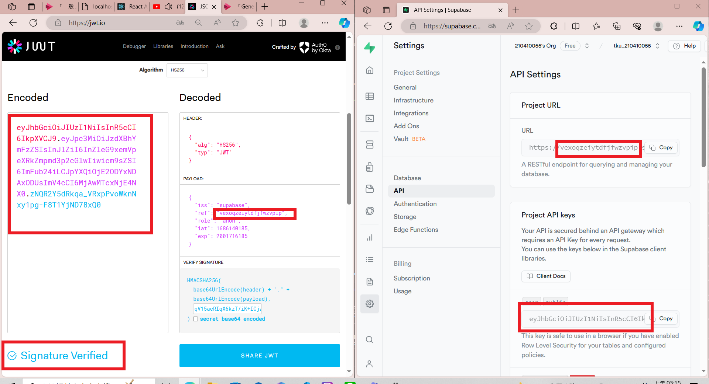
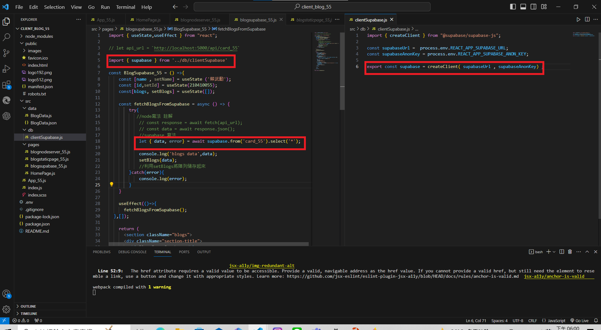
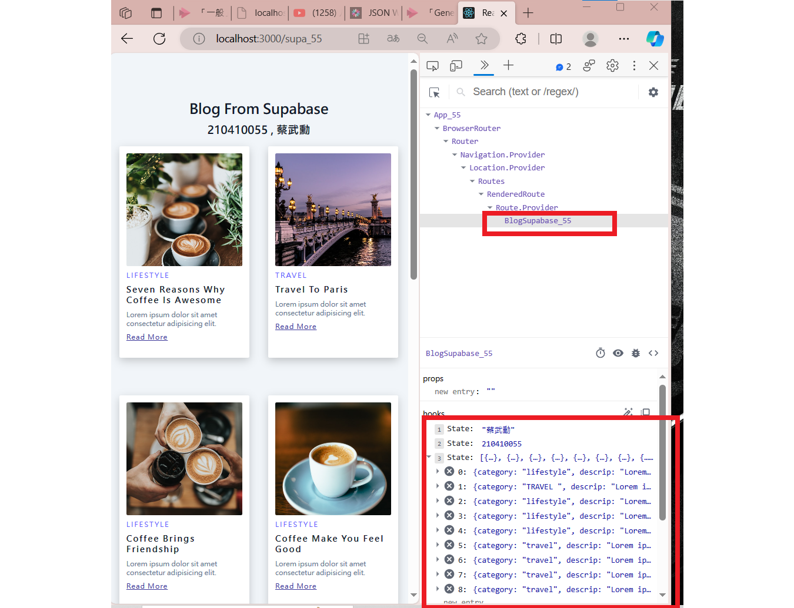
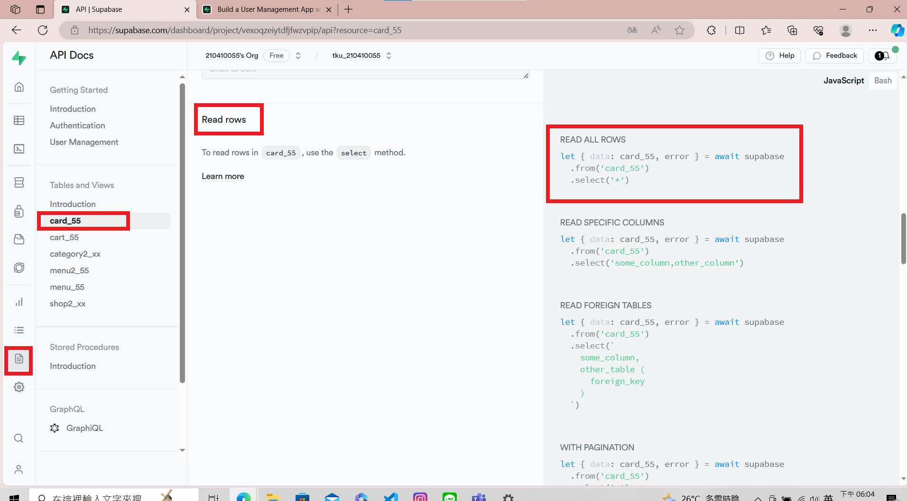
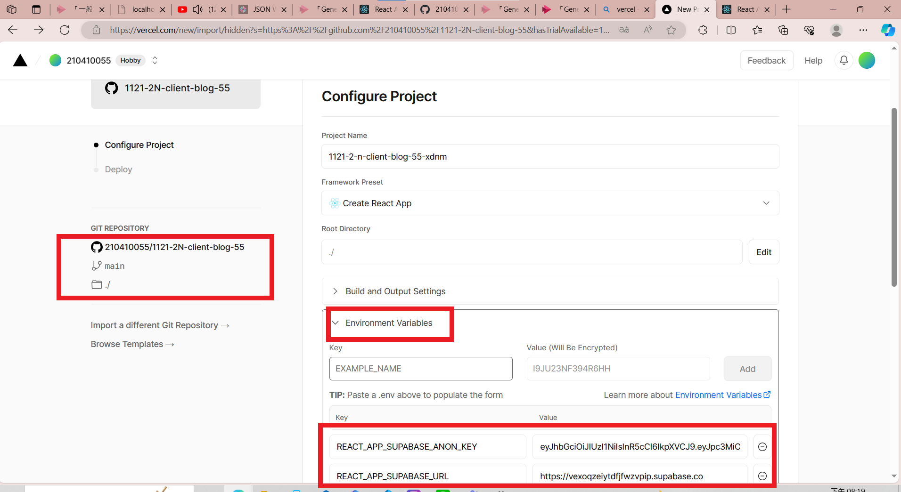
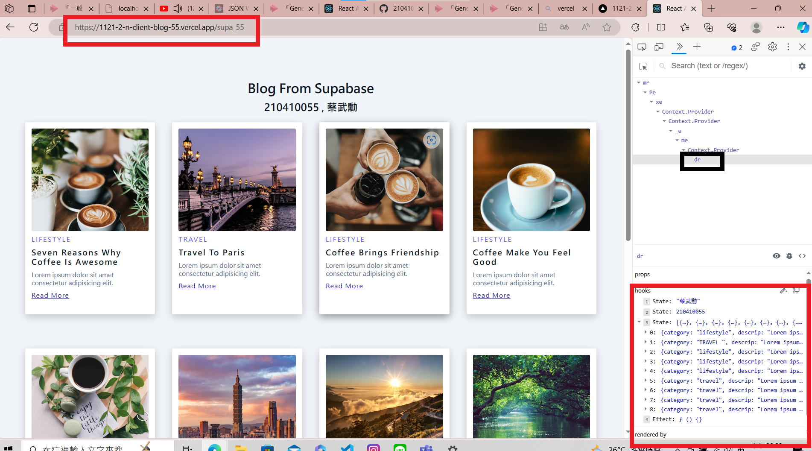
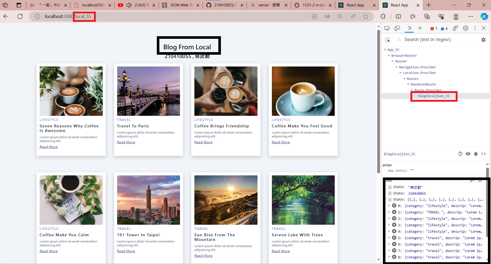
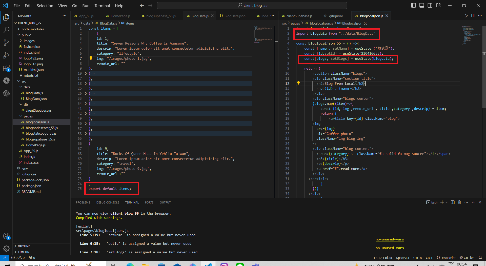
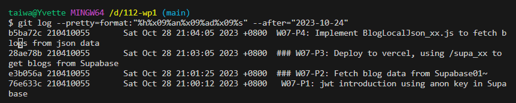

### W07-P1: jwt introduction using anon key in Supabase



 ### W07-P2: Fetch blog data from Supabase


 

 


### W07-P3: Deploy to vercel, using /supa_xx to get blogs from Supabase

[Vercel URL](https://1121-2-n-client-blog-55.vercel.app/supa_55) 


 


### W07-P4: Implement BlogLocalJson_xx.js to fetch blogs from json data
 




### W07-P5: W7 all logs
 


```
b5ba72c 210410055       Sat Oct 28 21:04:05 2023 +0800  W07-P4: Implement BlogLocalJson_xx.js to fetch blogs from json data
28ae78b 210410055       Sat Oct 28 21:03:05 2023 +0800  ### W07-P3: Deploy to vercel, using /supa_xx to 
get blogs from Supabase
e3b056a 210410055       Sat Oct 28 21:01:25 2023 +0800  ### W07-P2: Fetch blog data from Supabase01~    
76e633c 210410055       Sat Oct 28 21:00:12 2023 +0800   W07-P1: jwt introduction using anon key in Supabase
```