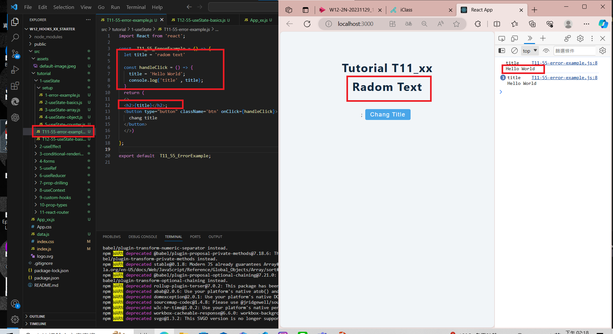
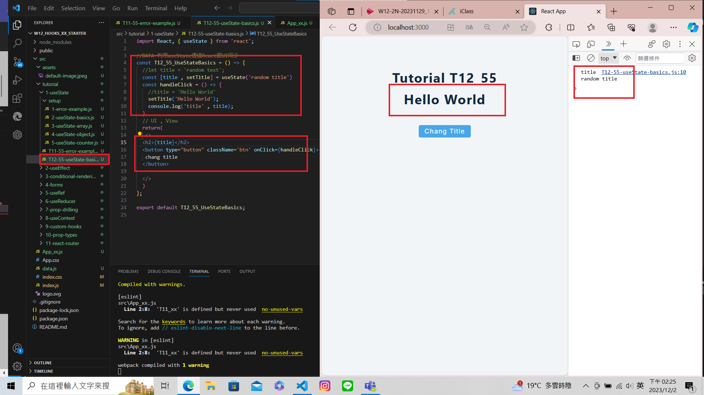
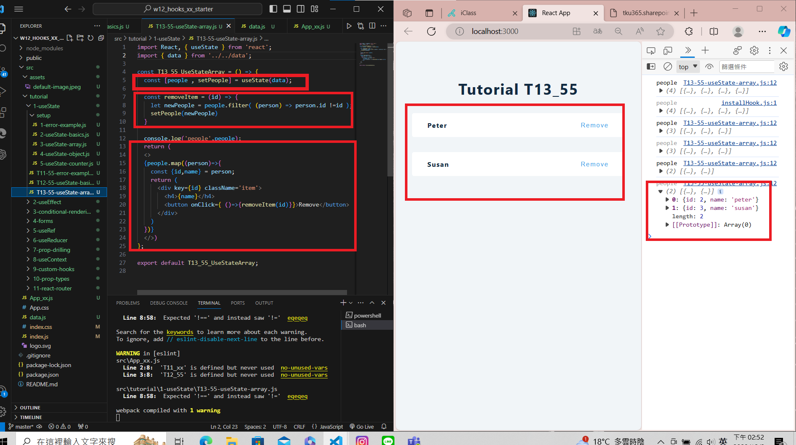

[My Github Repo URL](https://github.com/210410055/112-wp1/tree/main)

 ### W12-P1: Do advanced hooks: T11_xx & T12_xx
 

 


### W12-P2: Do T13_xx using array
 


 ### W12-P3: Do T14_xx using object
 


 ### W12-P4: Do T23_xx, fetch Github users using useEffect
 


### W012-P5: W12 all logs
 


```
git log --pretty=format:"%h%x09%an%x09%ad%x09%s" --after="2023-12-1"
0b1e1d0 210410055       Sat Dec 2 15:57:14 2023 +0800    ### W12-P4: Do T23_xx, fetch Github users using useEffect
3e62ff7 210410055       Sat Dec 2 15:13:40 2023 +0800    ### W12-P3: Do T14_xx using object
b735956 210410055       Sat Dec 2 15:13:09 2023 +0800    ### W12-P3: Do T14_xx using object
e75d117 210410055       Sat Dec 2 14:54:44 2023 +0800   ### W12-P2: Do T13_xx using array
4614b9b 210410055       Sat Dec 2 14:31:22 2023 +0800    ### W12-P1: Do advanced hooks: T11_xx & T12_xx 
```