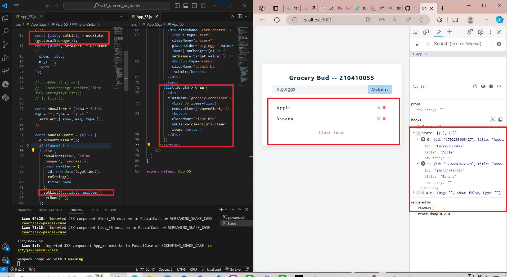
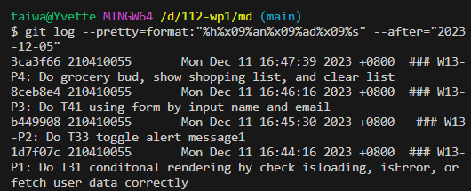

[My Github Repo URL](https://github.com/210410055/112-wp1/tree/main)
### W13-P1: Do T31 conditonal rendering by check isloading, isError, or fetch user data correctly


 ### W13-P2: Do T33 toggle alert message
 


 ### W13-P3: Do T41 using form by input name and email
 


### W13-P4: Do 
grocery bud, show shopping list, and clear list
 

 


### W13-P5: W13 git logs
 


```
$ git log --pretty=format:"%h%x09%an%x09%ad%x09%s" --after="2023-12-05"
3ca3f66 210410055       Mon Dec 11 16:47:39 2023 +0800  ### W13-P4: Do grocery bud, show shopping list, and clear list
8ceb8e4 210410055       Mon Dec 11 16:46:16 2023 +0800  ### W13-P3: Do T41 using form by input name and email
b449908 210410055       Mon Dec 11 16:45:30 2023 +0800   ### W13-P2: Do T33 toggle alert message1
1d7f07c 210410055       Mon Dec 11 16:44:16 2023 +0800  ### W13-P1: Do T31 conditonal rendering by check isloading, isError, or 
fetch user data correctly
```