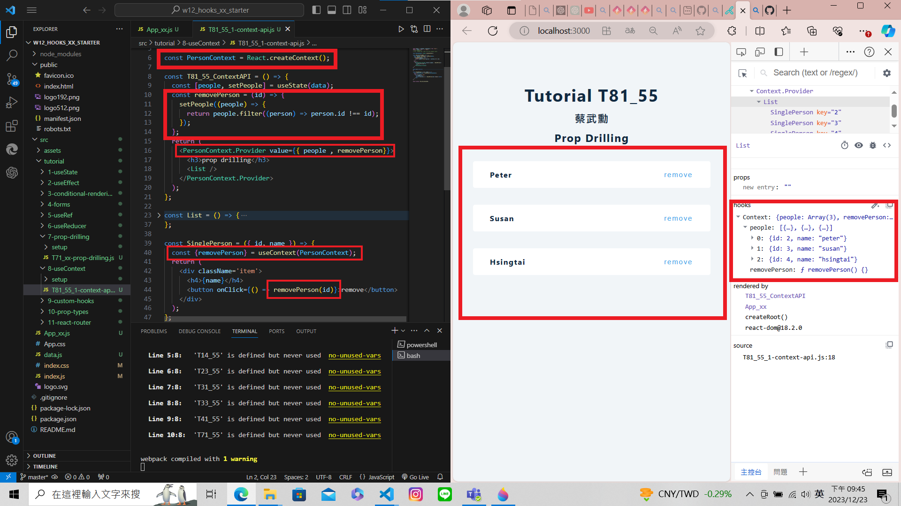
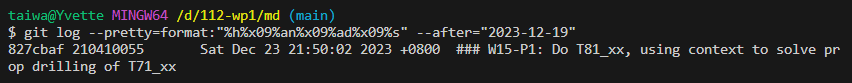

[My Github Repo URL](https://github.com/210410055/112-wp1/tree/main)

### W15-P1: Do T81_xx, using context to solve prop drilling of T71_xx
 

 


### W15-P5: Git logs for W15
 


```
git log --pretty=format:"%h%x09%an%x09%ad%x09%s" --after="2023-12-19"
827cbaf 210410055       Sat Dec 23 21:50:02 2023 +0800  ### W15-P1: Do T81_xx, using context to solve prop drilling of T71_xx

```