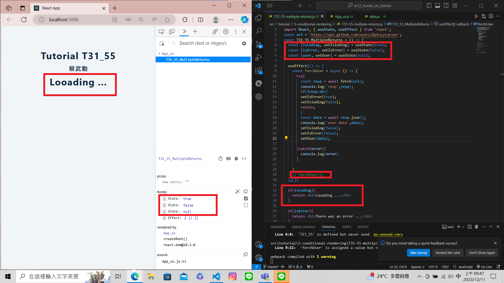
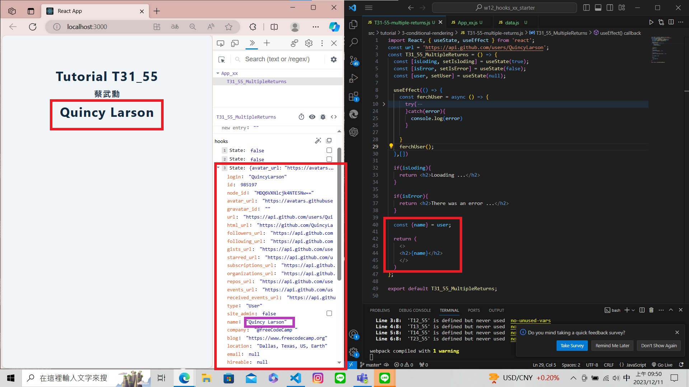
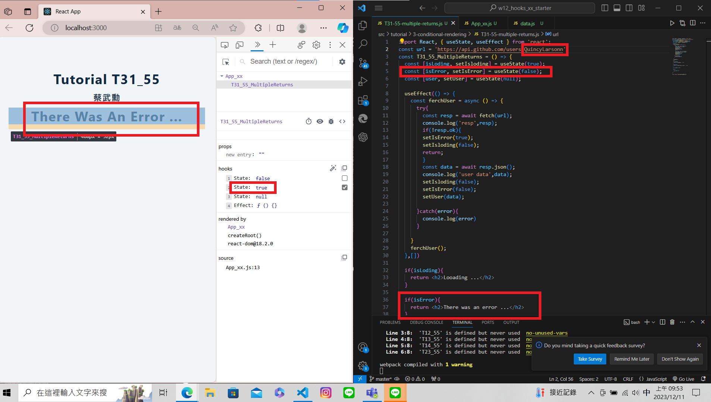
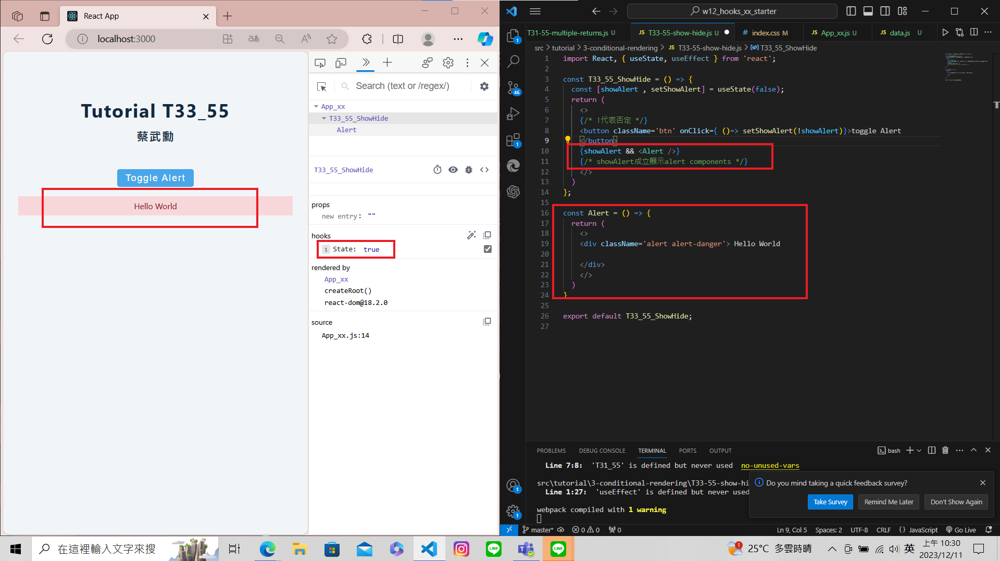

[My Github Repo URL](https://github.com/210410055/112-wp1/tree/main)
### W13-P1: Do T31 conditonal rendering by check isloading, isError, or fetch user data correctly

 ### W13-P2: Do T33 toggle alert message
 
